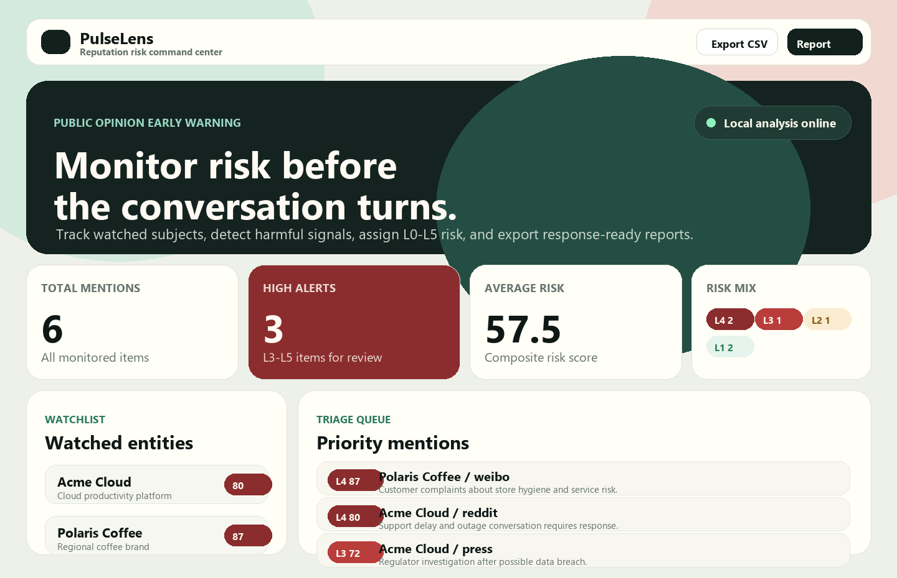

# PulseLens

PulseLens is an open-source social listening and public-opinion early-warning workbench for maintainers, researchers, small teams, and individual creators.

It helps you monitor mentions of a person, brand, project, or organization, classify sentiment, estimate reputational risk, and generate practical response suggestions before a conversation turns into a crisis.



## Why this project exists

Most social listening products are expensive SaaS tools. Many open-source attempts depend on fragile scraping or private platform APIs. PulseLens starts from a safer and more portable foundation:

- Bring your own data through CSV exports, RSS feeds, or future connectors.
- Run analysis locally with transparent scoring rules.
- Keep the risk model explainable enough for research and audit.
- Make response recommendations visible, editable, and exportable.

## Core features

- **Entity monitoring**: Track multiple watched subjects with keyword aliases.
- **CSV import**: Ingest exported posts, comments, news snippets, tickets, or survey text.
- **RSS import**: Pull public web feeds without relying on private social APIs.
- **Multilingual sentiment baseline**: Includes English and Chinese lexicons for favorable, harmful, and urgent signals.
- **Risk scoring**: Combines sentiment, reach, urgency, source weight, and keyword matches.
- **PRD-aligned crisis levels**: Labels items as L0-L5, from normal monitoring to major crisis.
- **Risk type detection**: Classifies likely product, service, legal, security, privacy, or reputation risk.
- **Topic clustering**: Groups similar mentions into operational themes such as service complaints, data security, product quality, legal/regulatory, and viral reputation risk.
- **Response strategy**: Suggests amplify, clarify, neutral-watch, de-escalate, or crisis-response actions.
- **Dashboard**: Local web UI for recent mentions, trend summaries, alerts, and entity-level risk.
- **Exports**: JSON endpoint, CSV export, and Markdown weekly report for reporting or research workflows.
- **Privacy-first local storage**: SQLite database stored on your machine.

## Dashboard Experience

The PulseLens dashboard is designed as a lightweight reputation-risk command center:

- A command header summarizes the active monitoring mode.
- KPI cards show total mentions, high-risk alerts, average risk, and L0-L5 distribution.
- The watchlist panel highlights monitored entities and their maximum risk scores.
- The triage queue prioritizes mentions by risk score, source, risk type, and response strategy.
- Topic clusters help reviewers move from scattered mentions to event-like themes.
- Export actions keep reporting close to the operational workflow.

## Quick start

```bash
python -m pip install -e .
pulselens seed
pulselens serve
```

Open http://127.0.0.1:8765 in your browser.

On Windows, the bundled helper script can be used without configuring PATH:

```powershell
.\run-pulselens.cmd seed
.\run-pulselens.cmd serve
```

## Import CSV

```bash
pulselens import-csv examples/sample_mentions.csv --entity "Acme Cloud"
```

CSV columns can include:

- `text` or `content` (required)
- `source`
- `url`
- `author`
- `published_at`
- `reach`

## Import RSS

```bash
pulselens import-rss https://example.com/feed.xml --entity "Acme Cloud"
```

## Export a Weekly Report

```bash
pulselens weekly-report --output exports/weekly-report.md
```

The report includes total mentions, L3-L5 alerts, sentiment distribution, platform distribution, risk types, priority alerts, and suggested next actions.

## Run tests

```bash
python -m unittest discover -s tests
```

## Roadmap

PulseLens follows a staged open-source roadmap instead of trying to become a full commercial social-listening SaaS on day one.

### MVP

- Subject and alias configuration.
- Bring-your-own-data imports through CSV, RSS, and manual entries.
- L0-L5 risk scoring with transparent rationale.
- Risk type classification and response strategy suggestions.
- Local dashboard, CSV export, and Markdown weekly report.

### Next

- Dashboard screenshots and richer README examples.
- Expanded Chinese risk and sentiment lexicons.
- Alert center with in-app and email notifications.
- Lightweight response-task workflow.

### Later

- Pluggable lawful connectors for Mastodon, Reddit exports, GitHub issues, YouTube comments exports, and news APIs.
- Research mode with coding sheets and inter-annotator agreement helpers.
- Better multilingual models with optional local LLM or API-backed classifiers.
- Webhook, Slack, Feishu, and DingTalk alert destinations.

## Scope Boundaries

PulseLens does not aim to bypass platform restrictions, scrape private chats, automate public replies, contact posters automatically, or provide legal services. The current open-source version focuses on compliant data import, transparent analysis, risk triage, and reporting.

## Responsible use

PulseLens is designed for lawful monitoring of public or user-provided data. Do not use it for harassment, surveillance, doxxing, or private-data collection. Respect platform terms, local law, and consent requirements.

## License

MIT
